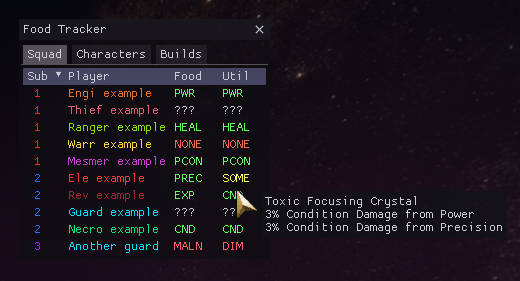
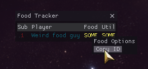

# GW2 ArcDPS Food Reminder
[ArcDPS](https://deltaconnected.com/arcdps) plugin for [Guild Wars 2](https://guildwars2.com) allowing tracking of buff food & utility items.

Published releases can be found [here](../../releases). Click [here](../../releases/latest/download/arcdps_food_reminder.dll) to directly download the latest release.

## Buff definitions
Definitions for Food & Utility buffs are loaded from `arcdps_food_reminder_definitions.json`.
The file should be created automatically the first time the plugin is loaded.
Default definitions are collected in [data/definitions.json](./data/definitions.json).  
The Malnourished & Diminished buffs are currently hardcoded and can not be changed.

**Found an unknown Food/Utility buff that you would like to see added?**  
Right click the entry in the tracker and select `Copy ID`.
Report the copied buff ID & the Food/Utility that applied it.

## Building from source
You need to have [Rust](https://www.rust-lang.org/learn/get-started) installed.

For the standard release version run `cargo build --release`.
For development you can include a debug log using the `--feature log` flag.

There is also a makefile provided for use with [cargo-make](https://github.com/sagiegurari/cargo-make).
To build & install the plugin run `cargo make install`.
You can provide a custom Guild Wars 2 installation path via the `GW2_PATH` environment variable.
