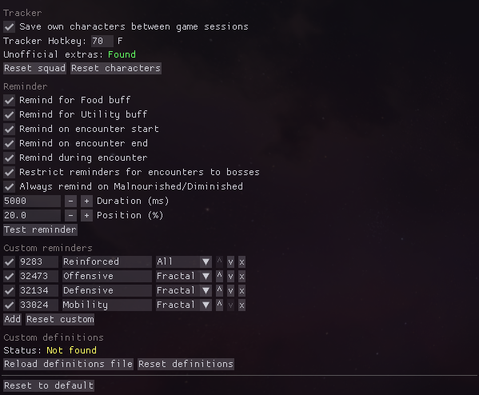

# ArcDPS Food Reminder
[ArcDPS](https://deltaconnected.com/arcdps) plugin for [Guild Wars 2](https://guildwars2.com) allowing tracking of buff food & utility items.

Published releases can be found [here](../../releases). Click [here](../../releases/latest/download/arcdps_food_reminder.dll) to directly download the latest release.




## Buff database
The default definitions for Food & Utility buffs are collected in [src/data/definitions.json](./src/data/definitions.json).

**Found an unknown Food/Utility buff that you would like to see added?**  
Right click the entry in the tracker and select `Copy ID`.
Report the copied buff ID & the Food/Utility that applied it.


## Custom definitions  
Custom definitions can be set by creating `arcdps_food_reminder_definitions.json` next to your `arcdps.ini` and other config/settings files.
The file uses the same format as [src/data/definitions.json](./src/data/definitions.json).
The format is also showcased below.
Entries using the same id will overwrite the default definition for a Food/Utility buff.

```json
{
  "food": [
    {
      "id": 57244,
      "name": "Cilantro Lime Sous-Vide Steak",
      "stats": ["66% Life Steal Chance", "+100 Power", "+70 Ferocity"],
      "display": "Power",
      "rarity": "Ascended"
    }
  ],
  "utility": [
    {
      "id": 9963,
      "name": "Superior Sharpening Stone",
      "stats": ["3% Power from Precision", "6% Power from Ferocity"],
      "display": "Power"
    }
  ],
  "ignore": [10110]
}
```

## Building from source
You need to have [Rust](https://www.rust-lang.org/learn/get-started) installed.

For the standard release version run `cargo build --release`.
The debug build will include additional log messages.

There is also a makefile provided for use with [cargo-make](https://github.com/sagiegurari/cargo-make).
To build & install the plugin run `cargo make install`.
You can provide a custom Guild Wars 2 installation path via the `GW2_PATH` environment variable.
